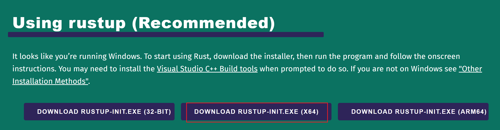

# 安装Rust

## 1.工具vs_BuildTools.exe

下载https://visualstudio.microsoft.com/zh-hans/visual-cpp-build-tools/工具

安装 [Microsoft C++ Build Tools](https://visualstudio.microsoft.com/zh-hans/visual-cpp-build-tools/)，勾选安装 C++ 环境

添加环境变量到PATH

%Visual Studio 安装位置%\VC\Tools\MSVC\%version%\bin\Hostx64\x64

## 2.官网下载rustup-init.exe

https://rust-lang.org/tools/install



```
PS C:\Users\Hehongyuan> rustup-init.exe
......
Current installation options:

   default host triple: x86_64-pc-windows-msvc
     default toolchain: stable (default)
               profile: default
  modify PATH variable: yes

1) Proceed with installation (default)
2) Customize installation
3) Cancel installation
```

## 3.安装

```
E:\QMDownload\Rust>rustup-init.exe
warn: It looks like you have an existing rustup settings file at:
warn: C:\Users\Administrator\.rustup\settings.toml
warn: Rustup will install the default toolchain as specified in the settings file,
warn: instead of the one inferred from the default host triple.

Welcome to Rust!

This will download and install the official compiler for the Rust
programming language, and its package manager, Cargo.

Rustup metadata and toolchains will be installed into the Rustup
home directory, located at:

  C:\Users\Administrator\.rustup

This can be modified with the RUSTUP_HOME environment variable.

The Cargo home directory is located at:

  C:\Users\Administrator\.cargo

This can be modified with the CARGO_HOME environment variable.

The cargo, rustc, rustup and other commands will be added to
Cargo's bin directory, located at:

  C:\Users\Administrator\.cargo\bin

This path will then be added to your PATH environment variable by
modifying the PATH registry key at HKEY_CURRENT_USER\Environment.

You can uninstall at any time with rustup self uninstall and
these changes will be reverted.

Current installation options:


   default host triple: x86_64-pc-windows-msvc
     default toolchain: stable (default)
               profile: default
  modify PATH variable: yes

1) Proceed with standard installation (default - just press enter)
2) Customize installation
3) Cancel installation
>

info: profile set to default
info: default host triple is x86_64-pc-windows-msvc
info: syncing channel updates for stable-x86_64-pc-windows-msvc
info: latest update on 2026-07-16 for version 1.97.1 (8bab26f4f 2026-07-14)
info: downloading 6 components
        cargo installed                        9.71 MiB
       clippy installed                        4.04 MiB
    rust-docs installed                       22.76 MiB
     rust-std installed                       21.56 MiB
        rustc installed                       69.04 MiB
      rustfmt installed                        2.46 MiB                                                                                                            info: default toolchain set to stable-x86_64-pc-windows-msvc

  stable-x86_64-pc-windows-msvc installed - (timeout reading rustc version)


Rust is installed now. Great!

To get started you may need to restart your current shell.
This would reload its PATH environment variable to include
Cargo's bin directory (%USERPROFILE%\.cargo\bin).

Press the Enter key to continue.


```

## 4.安装完成后新开一个cmd

```
rustc --version 
cargo --version


C:\Users\Administrator>rustc --version
rustc 1.97.1 (8bab26f4f 2026-07-14)
C:\Users\Administrator>cargo --version
cargo 1.97.1 (c980f4866 2026-06-30)
```

## 5,修改rust编译器地址

# VSCode

## 简介

```
Visual Studio Code(VSCode) 是微软 2015 年推出的一个轻量但功能强大的源代码编辑器，基于 Electron 开发，支持 Windows、Linux 和 macOS 操作系统。它内置了对 JavaScript，TypeScript 和 Node.js 的支持并且具有丰富的其它语言和扩展的支持，功能超级强大。Visual Studio Code 是一款免费开源的现代化轻量级代码编辑器，支持几乎所有主流的开发语言的语法高亮、智能代码补全、自定义快捷键、括号匹配和颜色区分、代码片段、代码对比 Diff、GIT 命令等特性，支持插件扩展，并针对网页开发和云端应用开发做了优化。
```

## 插件

1. `rust-analyzer` Rust 社区 yyds!
2. `Even Better TOML`，支持 .toml 文件完整特性
3. `Error Lens`, 更好的获得错误展示
4. `One Dark Pro`, 非常好看的 VSCode 主题
5. `CodeLLDB`, Debugger 程序

# 创建第一个项目

```
cargo new world_hello
cd world_hello

├── .git
├── .gitignore
├── Cargo.toml
└── src
    └── main.rs

$ cargo run
   Compiling world_hello v0.1.0 (/Users/sunfei/development/rust/world_hello)
    Finished dev [unoptimized + debuginfo] target(s) in 0.43s
     Running `target/debug/world_hello`
Hello, world!

$ cargo build
    Finished dev [unoptimized + debuginfo] target(s) in 0.00s
    
$ ./target/debug/world_hello
Hello, world!

cargo run --release
cargo build --release
试着运行一下我们高性能的 release 程序：

$ ./target/release/world_hello
Hello, world!

$ cargo check
    Checking world_hello v0.1.0 (/Users/sunfei/development/rust/world_hello)
    Finished dev [unoptimized + debuginfo] target(s) in 0.06s
```

